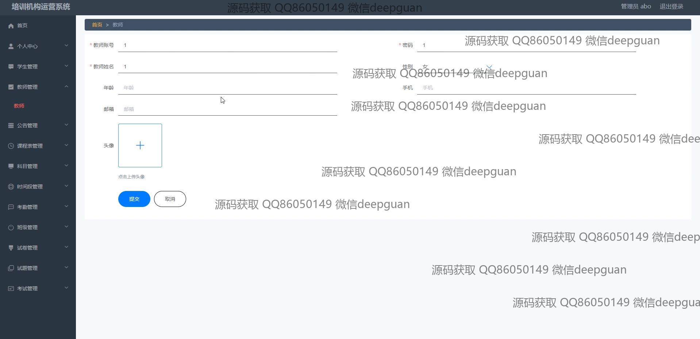
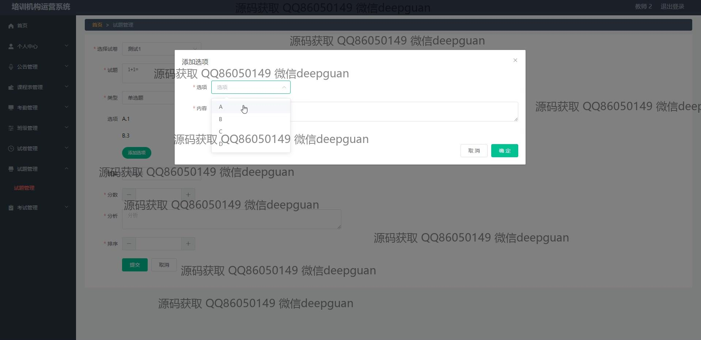

<h1 align="center">培训机构运营系统+vue</h1>

## 简介
培训机构运营系统：角色分为管理员、学生、教师；实现用户注册、教师管理、学生管理、课程管理、试卷管理等功能，支持考勤记录和在线考试，界面简洁易操作。    --计算机毕业设计源码；毕设源码；java毕业设计源码

## 联系方式

<h3 align="center">获取完整代码与数据库文件 + 微信：deepguan QQ: 86050149 QQ群: 783742310</h3>

<h3 align="center">可帮忙远程部署 包运行成功！提供远程部署、修改代码、设计文档指导、代码讲解等服务！</h3>

## 功能介绍（完整见运行截图）
管理员：登录、注册、退出系统；管理学生、教师、课程、班级、考勤、公告、试卷、考试和题目；编辑系统内各类信息，包括用户信息、课程安排和考勤记录；支持试卷与题目管理，创建、修改、删除及查询考试相关数据；查看系统日志与操作记录；拥有全局管理权限，负责整体运营和维护。

教师：登录系统，查看与管理个人课程信息；分配与查询班级、学生信息；参与课程和考试管理，设置考试题目与评分标准；进行考勤记录管理，包括上传考勤图片、记录考勤时间；编辑与更新公告信息；操作方便，助力教学资源高效管理。

学生：登录、注册账号，查看个人信息；参与课程学习，查询课程表与考试安排；完成在线考试，提交试卷和查看成绩；查看与参与公告互动；管理个人信息，便于课程参与与学习管理。

访客：无需登录即可浏览公共信息；进行注册成为学生或教师；了解系统公告与课程资源；可通过主界面访问系统的基本功能模块。

## 运行截图

本代码来源于网络,仅供学习参考使用!

